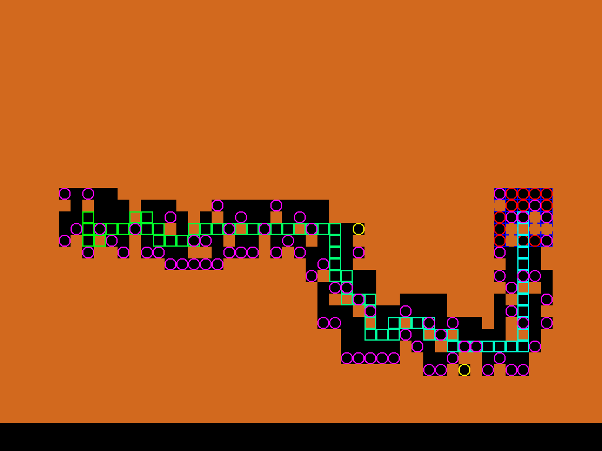

# Procedural Content Generation via PPO

A reinforcement-learning agent based framework that generates 2D platformer levels under **hard solvability constraints**, trained in a custom Gym-compatible environment.

## TL;DR

Given a target player path with structural constraints, a PPO-trained agent generates a tile-based platformer level that satisfies the path. On a held-out test set of **100 randomly-generated constrained paths**, the agent produced fully playable levels **52% of the time**, significantly outperforming random-generation baselines. Every level the agent *marked* solvable was verified playable when loaded into a Unity platformer.

## Why this problem

Procedural content generation with hard playability constraints is a toy problem standing in for a much bigger question:

> How do we train agents whose outputs must satisfy **structural rules**, not just maximise a scalar reward?

The reward shaping, environment design, and evaluation protocol here generalise well beyond platformers. The same pattern applies to any setting where the generated artefact must satisfy hard validity constraints (schematic design, code generation with specification, molecule design under synthesisability, form-filling under domain rules).

## Approach

- **Environment.** Custom grid-world platformer built on Gym. Rendering included so generated levels are visually inspectable, not just tensors.
- **Agent.** Recurrent PPO. Policy learns to place tiles sequentially, conditioned on the target path and partial world state.
- **Reward shaping.** Sparse reward for playability proved uninformative. Shaped reward combines path reachability, tile-placement validity, and penalties for dead ends. Reward design was the hardest part of the project and is the main empirical contribution of the dissertation.
- **Export.** Final levels serialise to JSON, portable to any game engine. The Unity client is used as an external verifier.

## Evaluation

| Metric | Value |
|---|---|
| Test-set size | 100 randomly-sampled constrained player paths |
| Random-generation baseline (approach A) | 1% |
| Random-generation baseline (approach B) | 4% |
| Fully-playable levels (RL agent) | **52%** |
| Human verification | All agent-marked-solvable levels were playable in Unity |

/path_complexities.png)

Sample generated level:



### Legend
- Squares - target player-path cells (approximate route the in-game player should follow).
- Pink circles - cells reachable from the spawn.
- Yellow circles - "hanging" cells (valid tiles with no path leading to them; evidence of local overfit).

## What didn't work

- **Pure-sparse reward** (+1 only on fully solvable level) never converged. The state-action space is too large. This is why reward shaping dominates the dissertation.
- **CNN-only policy** underperformed recurrent PPO once the path length exceeded ~15 cells. The agent needed memory of earlier placements to maintain path coherence.
- **Curriculum learning attempts** (start with short paths, grow) did not produce the hoped-for transfer. An agent trained on length-5 paths did not generalise well to length-20. Flat training with varied lengths worked better.

## Repo tour

```
.
├── envs/my_env/            # custom Gym environment + renderer
├── ppo.py                  # PPO training loop
├── baseline.py             # random-generation baselines for comparison
├── constants.py            # hyperparameters and env config
├── helper.py
├── pathfinder.py           # reachability and validity checks
├── visualizer.py           # rendering utilities
├── ppo_training_logs/      # TB logs, checkpoints
└── saves/                  # trained models and evaluation artefacts
    ├── visualizations/
    └── evaluation/
```

## Where this could go

- **Formal ablation** on reward-shaping terms (quantify each component's contribution).
- **Learned reward models** instead of hand-crafted shaping, using playability as the ground-truth signal.
- **Transfer to adjacent PCG domains** - Sokoban puzzles, tower-defence layouts - to test whether the approach generalises or is specific to platformers.
- **Constraint-conditioned diffusion** as an alternative generator, comparing sample quality and constraint satisfaction.

## Tech

Python - PyTorch - Stable-Baselines3 (Recurrent PPO) - Custom Gym env - Unity (external verifier)

## Contact

mohanselvan.r.5814@gmail.com
